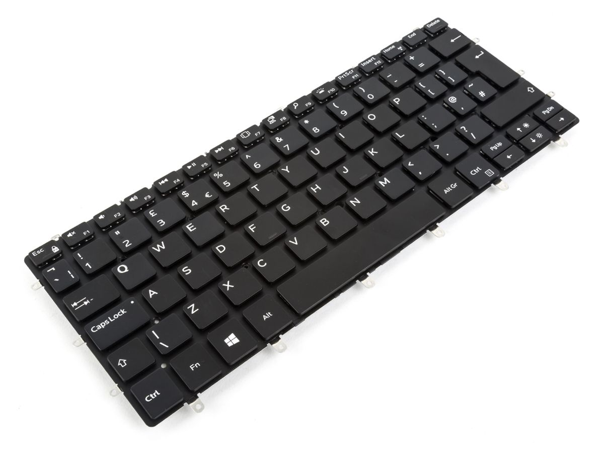
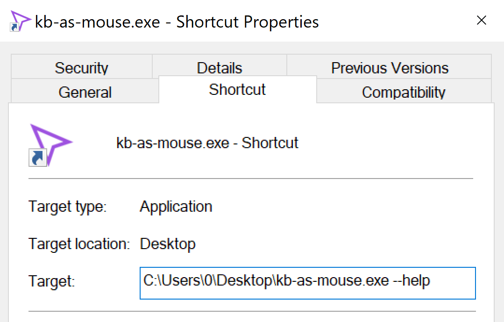
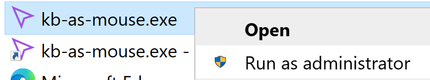

# kb-as-mouse

Joystick-like mouse control with the keyboard on Windows.

## Usage

Mouse movement is controlled with the `pl;'` keys; scrolling is controlled with `o[`. Right ALT simulates left clicks, and `,` simulates right clicks. Holding ENTER will cause all movement to be slower.

Running kb-as-mouse launches a tray icon. The application can be terminated by right-clicking the icon, and paused/resumed by left-clicking the icon. Pause/resume is also possible with the APPLICATIONS/MENU key (looks like a hamburger icon).

Keys and physics customizations can be made via command-line options. Run the application with `--help` to get help on the command-line options available. The FAQ covers how to specify command-line options.

## FAQ

### Can I use this to play games without a mouse?

For some games, especially those which use joystick-like mouse controls for camera, yes. For games which require fast reactions and precision, kb-as-mouse may not be a great choice.

This demo is played on keyboard with the default configuration on an XPS 13 9370.

https://user-images.githubusercontent.com/20709601/131892918-e7f3471b-bcb0-43c6-b39e-33b53a69fde7.mov

The keyboard looks like this. Observe the APPLICATIONS/MENU key is accessible via Fn+Right CTRL.



### How do I specify command-line options?

Create a shortcut, and open properties for the shortcut. The command-line options can be appended to the `Target` line.



An example command-line options string might look like this: `--slow-mod 0.3 --fps 240`. Virtual key codes can be found at <https://docs.microsoft.com/en-us/windows/win32/inputdev/virtual-key-codes>. Specify `--help` to view the available command-line options.

### kb-as-mouse isn’t working in some windows (Task Manager, games, etc.).

Task Manager and many games are run in Administrator Mode (elevated privileges). Thus, to inject mouse actions into elevated applications, kb-as-mouse must also be run with elevated privileges.

To do this, right click and select “Run as adminstrator”. Optionally, this can be set as default on a shortcut.



### Why use kb-as-mouse instead of [AutoHotkey, Windows Ease of Access, etc.]?

AHK scripts can accomplish the same thing as kb-as-mouse, but customization requires far more additional work and learning the AHK scripting language.

On the other hand, Windows Ease of Access has a nice graphical UI, but the mouse movement is janky and customization is very little.

## Development

You'll want to grab the `rain` submodule with:

```bash
git submodule init
git submodule update
```

kb-as-mouse is set up as a Visual Studio project in `build/`, with the rain dependencies included.
